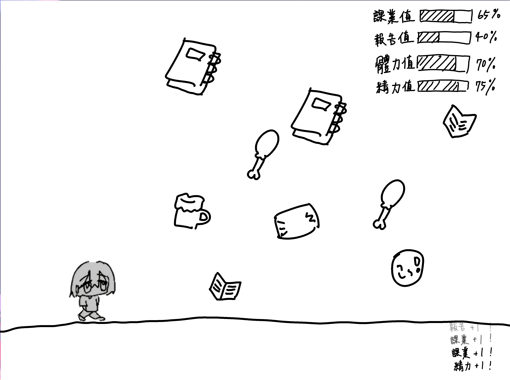
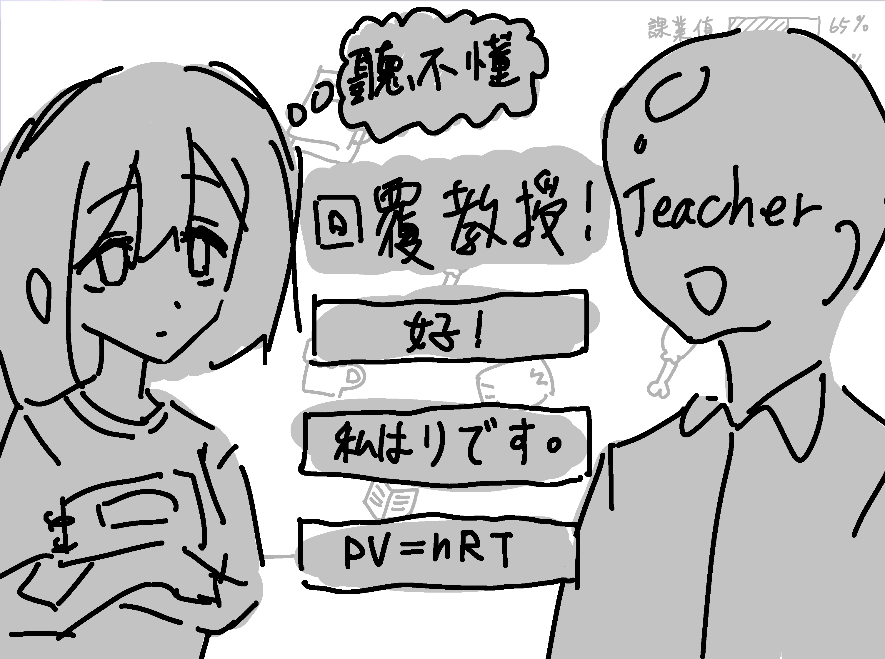
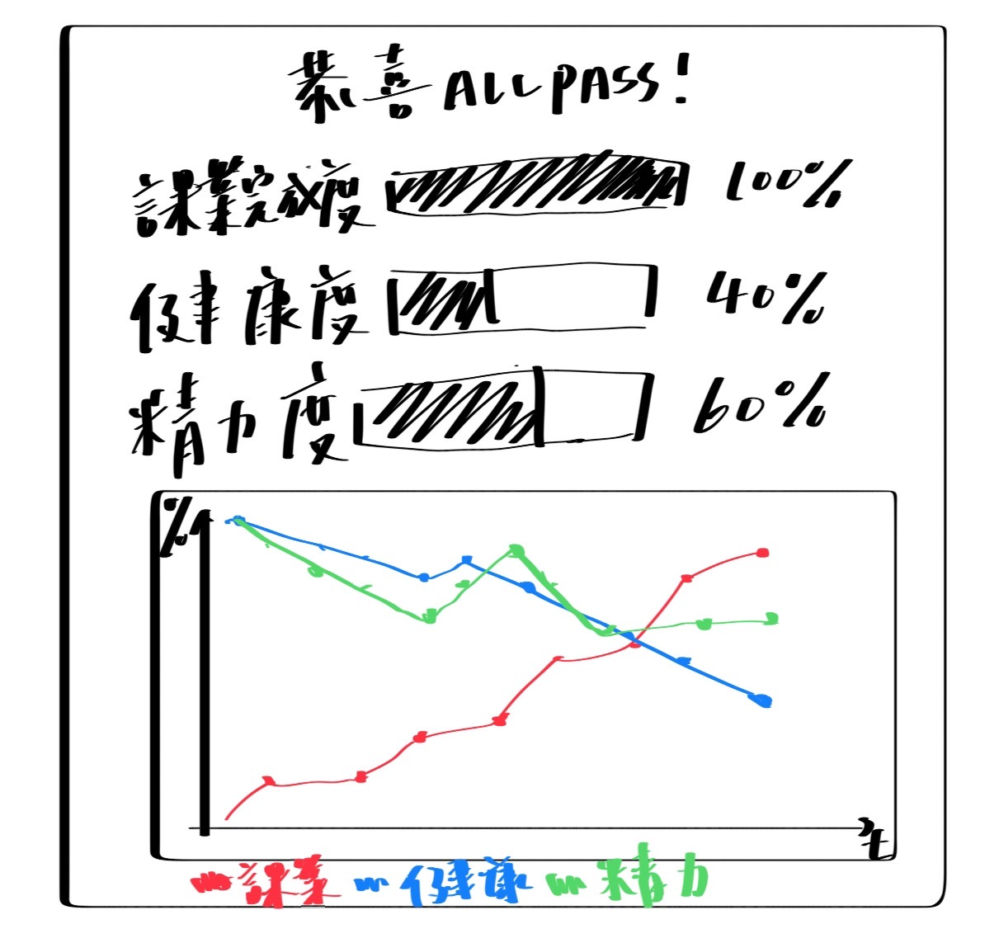
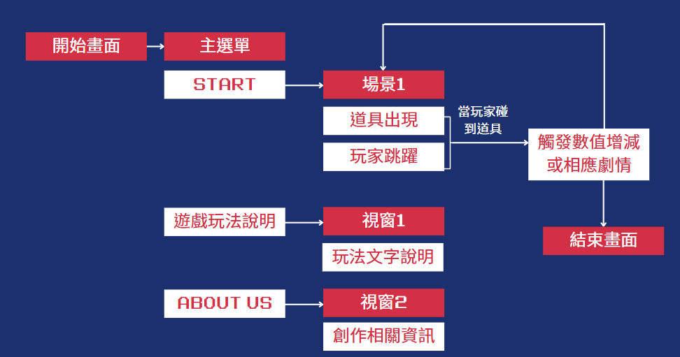

# 113-2 Programming Language Final Project 
# Life Explosion Simulator: Final Exam Hell Edition

## 組員:
- <a href="https://github.com/PhoebeLu1011"> @PhoebeLu1011</a>
- <a href="https://github.com/kurakanja"> @kurakanja</a>

## 第一次審查連結 : https://youtu.be/SExgqFcxvvw
## 第二次進度追蹤 : https://youtu.be/0_wMfQdEzZ0

## 動機 
身為大學生的我們，每學期在期末時，必經歷大量作業、考試與專題的壓力，導致爆肝、熬夜與情緒崩潰等現象頻繁發生，俗稱 「期末地獄」。\
本專題希望遊戲模擬去呈現學生在期末地獄中掙扎的情境，讓使用者一方面娛樂放鬆，一方面反思自身學習與生活。

## 遊戲示意圖  
* 主介面

* 觸碰教授圖像，觸發情節圖

* 遊戲結束畫面

## 使用程式
* PYTHON
* PYGAME
* 作業二-資料視覺化
  
## 遊戲流程

## 道具介紹

### 各項值選項介紹

* 課業完成度：[█████████░░] 90%
* 健康值：[█████████░░] 90%
* 精力值：[█████████░░] 90%

### 道具介紹

| 道具圖 | 道具名稱 | 說明 |
|--------|------|------|
|  | 書 | 課業完成度+10、 精力值-20|
|  | 報告 |課業完成度+10、精力值+5|
|  | 食物:(雞腿) |健康值+5、精力值+5|
|  | 睡覺(枕頭) |健康值+10、精力值+5 注意:接觸5次睡覺時會觸發特殊事件(在圖書館睡著)，導致讀書進度-10|
|  | 喝酒(啤酒杯) |健康值-15、精力值+10 注意:接觸5次喝酒時會觸發特殊事件(參加酒局，隔天宿醉)，導致健康值-10、課業完成度-10|
|  | 教授 |稀有!根據四種不同事件，可能使精力值-10~+5、課業完成度-10~+10不等 以下為四種不同的事件: 1."太好了同學，剛好你來幫我整理這些文件吧!"(被迫幫忙教授):精力值-10 2. “同學有哪裡不懂嗎"(和教授討論中):課業完成度+10 3."同學你的報告寫得非常好!"(被誇獎了好開心):精力值+5 4."同學你來幫忙紀錄一下這場會議好嗎，還有明天順便幫我聯絡，禮拜五的時候也......"(事情突然好多......):精力值-10、課業完成度-10|

### 各項值使用方法說明

1.  各項數值意義 :\
作業完成度  → 破關條件\
精力值 → 體力❤️❤️❤️❤️❤️\
健康值 → (倒數)時間
2.  遊戲方法:\
當作業完成度=100%  → 跳出結局1(all pass，拯救期末成功)\
當作業完成度< 100% → 繼續遊戲\
                  → 當精力值=0%→跳出結局2(救護車出現將玩家送進醫院)\
                  → 當健康值=0%→跳出結局3(有科目被當掉，拯救期末失敗)

