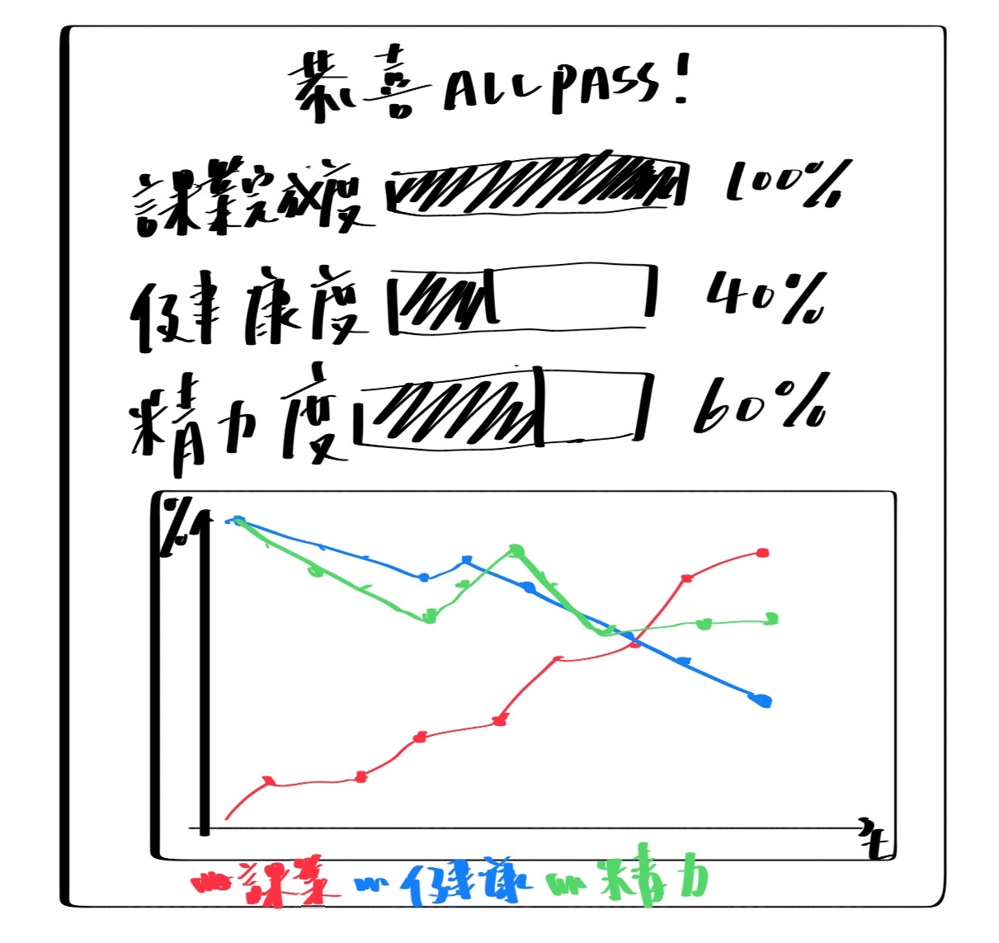

# 113-2 Programming Language Final Project 
# Life Explosion Simulator: Final Exam Hell Edition
## 組員:
- <a href="https://github.com/PhoebeLu1011"> @PhoebeLu1011</a>
- <a href="https://github.com/kurakanja"> @kurakanja</a>
## 第一次審查連結 : https://youtu.be/SExgqFcxvvw
## 動機 
身為大學生的我們，每學期在期末石，必經歷大量作業、考試與專題的壓力，導致爆肝、熬夜與情緒崩潰等現象頻繁發生，俗稱 「期末地獄」。\
本專題希望遊戲模擬去呈現學生在期末地獄中掙扎的情境，讓使用者一方面娛樂放鬆，一方面反思自身學習與生活。

## 遊戲示意圖  
* 主介面

* 觸碰教授圖像，觸發情節圖

* 遊戲結束畫面

## 使用程式
* PYTHON
* PYGAME
* 作業二-資料視覺化
  
## 遊戲流程

## 道具介紹

### 各項值選項介紹

* 課業完成度：[█████████░░] 90%
* 健康值：[█████████░░] 90%
* 精力值：[█████████░░] 90%

### 道具介紹

| 道具圖 | 說明 |
|--------|------|
|  | 課業完成度+1、 精力值-1|
|  |課業完成度+1、精力值-1|
|  |健康值+1、精力值+1|
|  |健康值+1、精力值+2 注意:接觸太多次睡覺可能觸發在圖書館睡著事件，導致讀書進度-5|
|  |健康值-1、精力值+2 注意:接觸太多次喝酒可能觸發酒局嘔吐事件，導致健康值-5|
|  |稀有!精力值-1 注意:接觸教授必觸發回答問題事件，根據回答機率性獲得課業完成度+10到-5(獲得知識或是被委託其他事件導致讀書進度拖延)|

### 各項值使用方法說明

1.  各項數值意義 :\
作業完成度  → 破關條件\
精力值 → 體力❤️❤️❤️❤️❤️\
健康值 → (倒數)時間\
2.  遊戲方法:\
當作業完成度=100%  → 跳出結局1(all pass，拯救期末成功)\
當作業完成度< 100% → 繼續遊戲\
                  → 當精力值=0%→跳出結局2(救護車出現將玩家送進醫院)\
                  → 當健康值=0%→跳出結局3(有科目被當掉，拯救期末失敗)\

